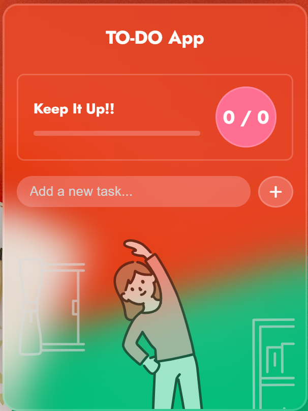
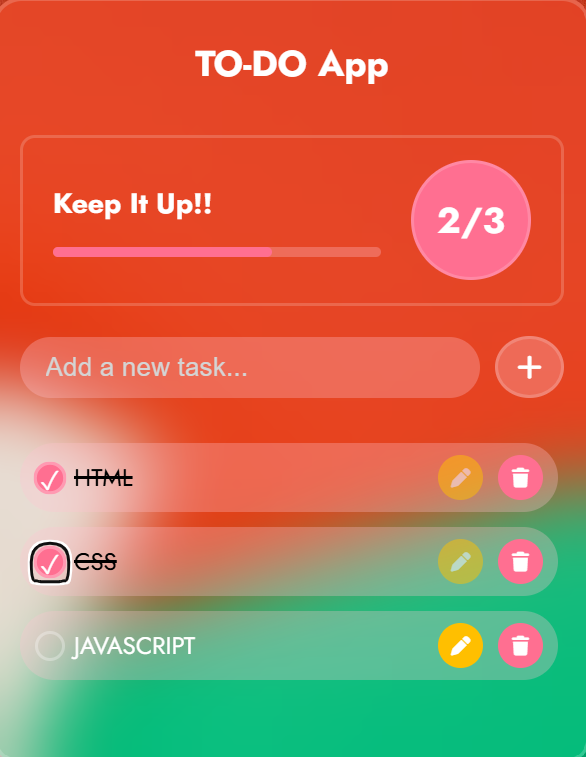
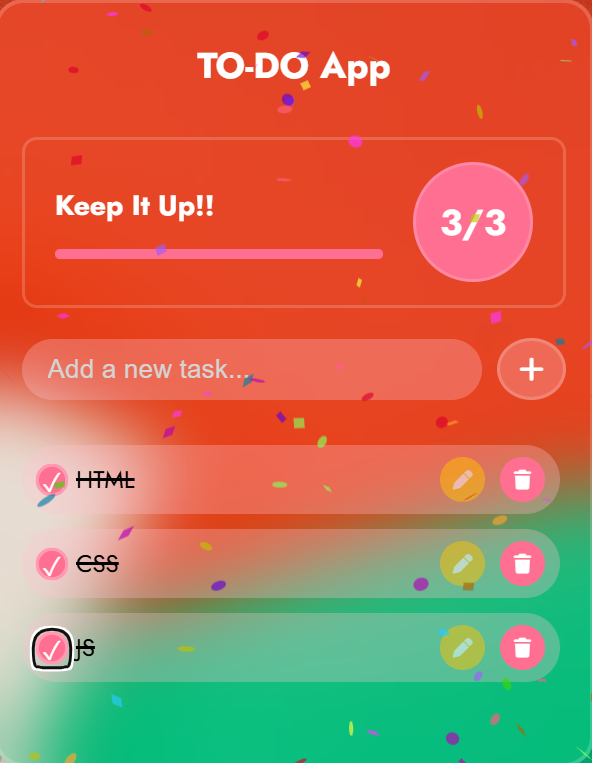

# ✅ To-Do List App

This is a simple and clean **To-Do List** web app built using **HTML**, **CSS**, and **JavaScript**.  
It helps users manage their daily tasks with ease.

---

## 📸 Screenshots

### 🏠 Home Page



---

### ➕ Add Task



---

### ✨ Animation after completing all tasks



---

## 🧠 Features

- ✅ Add new tasks
- 📝 Mark tasks as completed
- ❌ Delete tasks
- 💡 Animation on task completion
- 📱 Fully responsive on all devices
- 🎯 Clean, minimal UI/UX

---

## 🚀 How to Use

1. Clone the repo:
   ```bash
   git clone https://github.com/Hasnan42/todo-list.git
   ```

## 📁 Project Structure

TO-DO-LIST/
├── index.html
├── style.css
├── script.js
├── assets/
│ ├── screenshot.png
│ ├── Task-ss.png
│ └── animation.png
└── README.md

## 🔧 Tech Stack

> HTML5

> CSS3

> JavaScript (Vanilla)

## 🌐 Connect With Me

🔗 LinkedIn https://www.linkedin.com/in/hasnan-anwar-460570213/

💻 GitHub https://github.com/Hasnan42/Hasnan42/blob/main/README.md

📧 hasnananwar42@gmail.com

## 🔗 Live Demo

🚀 [Click here to view the live app](https://hasnan42.github.io/todo-list/)
